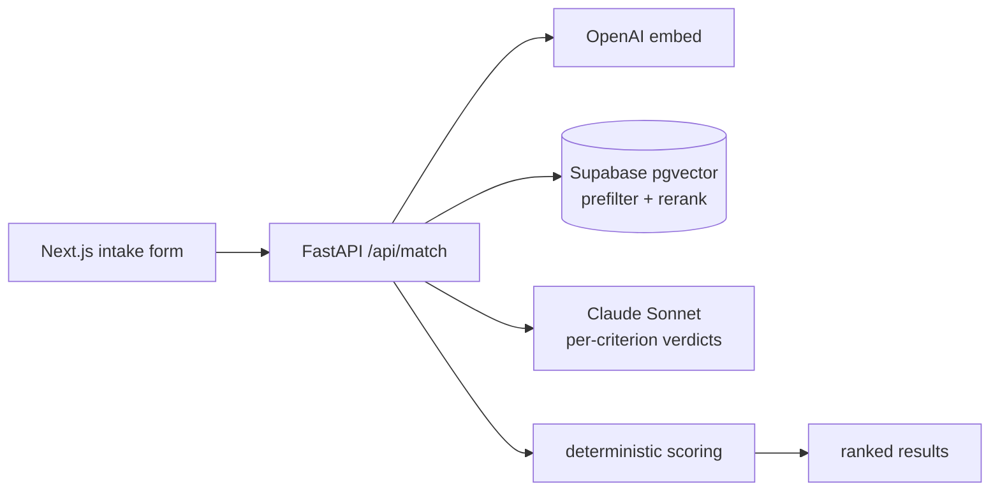

# Trial_Matching

[](https://github.com/Chen6528/Trial_Matching/actions/workflows/ci.yml)

Full-stack clinical trial matching: a patient/clinician fills out an intake form and gets a
**ranked list of ClinicalTrials.gov trials they're plausibly eligible for**, each with a
**per-criterion eligibility breakdown** and a **confidence score**.

The differentiator is correctness on eligibility *logic* — negations ("no prior EGFR TKI"),
numeric thresholds ("eGFR ≥ 60"), and age/sex windows — which embedding similarity alone
cannot resolve. So matching is a two-stage pipeline:

1. **Retrieve & shortlist** — pull recruiting trials from the CT.gov v2 API, normalize their
   criteria (Claude Haiku) and embed them (OpenAI) into Supabase/pgvector. At query time:
   structured SQL prefilter (status + age/sex) **then** vector cosine rerank → ~15 candidates.
2. **Reason per-criterion** — for each candidate, Claude Sonnet judges every criterion
   (`met` / `not_met` / `unknown`) with a cited reason; eligibility + confidence are then
   computed **deterministically in code**, never by the model.

## Demo


*Prefill an example patient → **Find matching trials** → expand any trial to see each criterion's
verdict (met / not_met / unknown) with the model's cited reason, plus an overall eligibility label
and confidence score.*

## Architecture


Ingest (offline): CT.gov v2 → Claude Haiku (normalize criteria) → OpenAI embed → Supabase.

## Repo
- [`backend/`](backend/) — FastAPI service (matching, ingestion, Supabase schema). **Built.** See its [README](backend/README.md).
- [`frontend/`](frontend/) — Next.js intake form + results UI. **Built.** See its [README](frontend/README.md).

Stack: FastAPI · Supabase/pgvector · OpenAI `text-embedding-3-small` · Claude (Haiku ingest,
Sonnet reasoning) · Next.js. Runs locally with `docker compose up` (see [Run locally](#run-locally));
hosting is optional and out of scope — runbook in [`docs/deploy.md`](docs/deploy.md).

## Run locally

```bash
cp backend/.env.example backend/.env   # fill Anthropic + OpenAI + Supabase keys
docker compose up --build              # backend on :8000, frontend on :3000
```

Open <http://localhost:3000>. Matching also needs the Supabase schema applied and at least one
condition ingested — see the [backend README](backend/README.md) for `schema.sql` + `ingest`.
Without Docker, run the backend and frontend dev servers directly (see their READMEs).

See [`docs/roadmap.md`](docs/roadmap.md) for the phased build plan (week-by-week status,
what's built, key decisions, and v1-vs-v2).

> **Disclaimer:** decision-support tool, not medical advice. No patient data is persisted.
